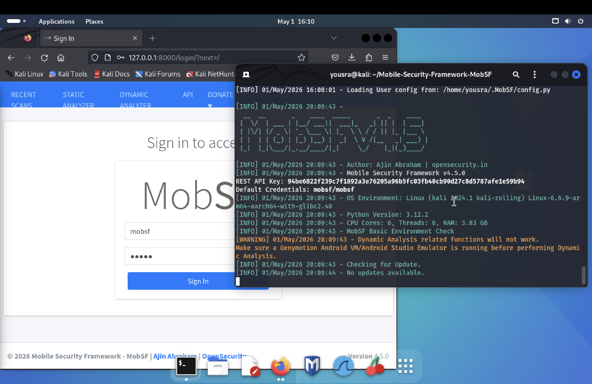

# 🔐 Mobile Security Audit — snake.apk

Static analysis of the Android application `snake.apk` (package: `com.pwnsec.snake`) using **MobSF v4.5.0** on Kali Linux.

---

## 📋 Application Info

| Field | Value |
|---|---|
| App Name | snake |
| Package | com.pwnsec.snake |
| Version | 1.0 (code: 1) |
| Size | 5.49 MB |
| Target SDK | 34 |
| Min SDK | 26 (Android 8.0) |
| Main Activity | com.pwnsec.snake.MainActivity |
| SHA256 | `b586c548f94c4006f5112b4edcabf0efb28a9bec531c741d0ce786d5aa4985c7` |
| Trackers Detected | 0 / 432 |
| **Security Score** | **67 / 100** |

---

## 🛠️ Environment

| Tool | Version |
|---|---|
| OS | Kali Linux 2024.1 (kali-rolling) |
| MobSF | v4.5.0 |
| Python | 3.12.2 |
| Analysis Date | 01/05/2026 |
| Analyst | Yousra |

---

## 📸 Screenshots

### MobSF Running


### Analysis Dashboard


### Permissions


### Manifest Analysis


### Components


---

## ⚠️ Findings Summary

| Severity | Count |
|---|---|
| 🔴 High | 0 |
| 🟡 Warning | 3 |
| 🔵 Info | 1 |
| ✅ Secure | 1 |

---

## 🔍 Vulnerabilities

### 1. Sensitive Data in Logs
- **Severity:** Info
- **OWASP MASVS:** MSTG-STORAGE-3
- **CWE:** CWE-532
- **Files affected:** `com/pwnsec/snake/MainActivity.java`, `com/pwnsec/snake/BigBoss.java` and 60+ others
- **Description:** The app uses logging functions that may expose sensitive data in system logs.
- **Fix:** Remove all `Log.d/Log.e` calls before production release, or use a logging wrapper that disables output in release builds.

---

### 2. Insecure Random Number Generator
- **Severity:** Warning
- **OWASP MASVS:** MSTG-CRYPTO-6
- **CWE:** CWE-330 / OWASP Top 10 M5
- **Files affected:** `A/o.java`, `R0/a.java`, `R0/b.java`, `R0/c.java`, `S0/a.java`
- **Description:** The app uses `java.util.Random` which is not cryptographically secure, making generated values predictable.
- **Fix:** Replace `java.util.Random` with `java.security.SecureRandom` for any security-sensitive operations.

---

### 3. External Storage Read/Write
- **Severity:** Warning
- **OWASP MASVS:** MSTG-STORAGE-2
- **CWE:** CWE-276 / OWASP Top 10 M2
- **Files affected:** `com/pwnsec/snake/MainActivity.java`
- **Description:** The app can read and write to external storage, which is accessible by any other app on the device.
- **Fix:** Store sensitive data in internal storage only, or use scoped storage properly.

---

### 4. Backup Enabled
- **Severity:** Warning
- **OWASP MASVS:** MSTG-STORAGE-8
- **Location:** `AndroidManifest.xml`
- **Description:** `android:allowBackup=true` allows anyone with USB debugging enabled to extract all app data via `adb backup`.
- **Fix:** Set `android:allowBackup=false` or define explicit backup rules excluding sensitive data.

---

### 5. FORTIFY Not Enabled in Native Libraries
- **Severity:** Warning
- **Location:** `x86_64/libsnake.so`, `arm64-v8a/libsnake.so`, `x86/libsnake.so`
- **Description:** Most native library builds are missing FORTIFY protection, which guards against buffer overflows in unsafe C functions.
- **Fix:** Compile with `-D_FORTIFY_SOURCE=2`. Note: `armeabi-v7a/libsnake.so` already has partial FORTIFY (`__vsnprintf_chk`).

---

## 🔑 Permissions

| Permission | Status |
|---|---|
| `MANAGE_EXTERNAL_STORAGE` | 🔴 Dangerous |
| `READ_EXTERNAL_STORAGE` | 🔴 Dangerous |
| `DYNAMIC_RECEIVER_NOT_EXPORTED_PERMISSION` | ⚪ Unknown |

> Both dangerous permissions grant broad file access — excessive for a snake game.

📄 Full data: [`Static_Analysis_permissions.csv`](Static_Analysis_permissions.csv)

---

## 📦 Exported Components

| Type | Component |
|---|---|
| Receiver | `androidx.profileinstaller.ProfileInstallReceiver` (exported, protected by `android.permission.DUMP`) |
| Provider | `androidx.startup.InitializationProvider` |

> The Broadcast Receiver is exported with a permission whose protection level is not defined in the app — any app declaring that permission could interact with it.

---

## 🔬 Binary Analysis

| Library | NX | PIE | Stack Canary | RELRO | FORTIFY |
|---|---|---|---|---|---|
| x86_64/libsnake.so | ✅ | ✅ | ✅ | Full | ❌ |
| arm64-v8a/libsnake.so | ✅ | ✅ | ✅ | Full | ❌ |
| x86/libsnake.so | ✅ | ✅ | ✅ | Full | ❌ |
| armeabi-v7a/libsnake.so | ✅ | ✅ | ✅ | Full | ⚠️ Partial |

📄 Full data: [`Static_Analysis_binary.csv`](Static_Analysis_binary.csv)

---

## 🗂️ OWASP MASVS Mapping

| Vulnerability | MASVS Reference | Status |
|---|---|---|
| Sensitive data in logs | MSTG-STORAGE-3 | ❌ Non-compliant |
| Insecure RNG | MSTG-CRYPTO-6 | ❌ Non-compliant |
| External storage access | MSTG-STORAGE-2 | ❌ Non-compliant |
| Backup enabled | MSTG-STORAGE-8 | ❌ Non-compliant |
| Root detection present | MSTG-RESILIENCE-1 | ✅ Compliant |

---

## ✅ Recommendations (Prioritized)

1. **[HIGH]** Replace `java.util.Random` with `java.security.SecureRandom`
2. **[HIGH]** Set `android:allowBackup=false` in `AndroidManifest.xml`
3. **[MEDIUM]** Remove or disable all logging calls before production
4. **[MEDIUM]** Remove `MANAGE_EXTERNAL_STORAGE` and `READ_EXTERNAL_STORAGE` if not strictly needed
5. **[LOW]** Recompile all native libraries with `-D_FORTIFY_SOURCE=2`

---

## 📁 Files in this repo

```
├── README.md
├── Static_Analysis_permissions.csv   # Permissions analysis data
├── Static_Analysis_code.csv          # Code analysis findings
├── Static_Analysis_binary.csv        # Binary/native library analysis
├── screenshot_mobsf_login.png        # MobSF running on Kali
├── screenshot_dashboard.png          # Analysis dashboard
├── screenshot_permissions.png        # Permissions view
├── screenshot_manifest.png           # Manifest analysis
└── screenshot_components.png         # App components
```

---

## 📚 References

- [OWASP MASVS](https://mas.owasp.org/MASVS/)
- [OWASP MASTG](https://mas.owasp.org/MASTG/)
- [MobSF GitHub](https://github.com/MobSF/Mobile-Security-Framework-MobSF)
- [Android Security Best Practices](https://developer.android.com/privacy-and-security/security-best-practices)
